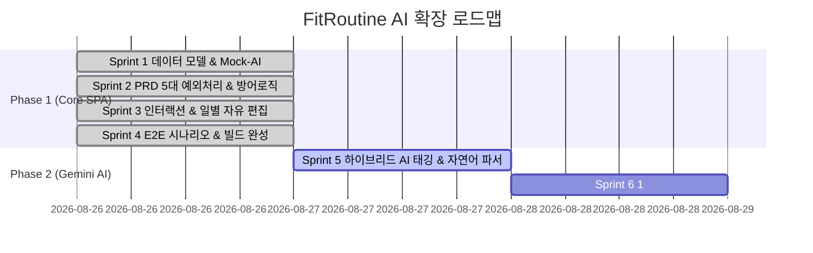

# 🗺️ FitRoutine 개발 로드맵 (Roadmap)

본 로드맵은 PRD 요구사항 기반의 클라이언트 코어 기능(Sprint 1~4) 완성과, 차세대 **Google Gemini AI 지능형 서비스 확장(Sprint 5~6)** 계획을 포함합니다.

---

## 📊 스프린트 전체 일정 및 진행 현황

---

## 🏃 스프린트별 상세 현황

### [Phase 1: 클라이언트 코어 기반 완성 (🟢 완료)]
- **Sprint 1:** 코어 상태 모델 & Mock-AI 자동 태깅 ([`sprint-1-core-state-and-tagging.md`](./sprints/sprint-1-core-state-and-tagging.md))
- **Sprint 2:** PRD 5대 필수 방어 로직 전수 구현 ([`sprint-2-exception-handling.md`](./sprints/sprint-2-exception-handling.md))
- **Sprint 3:** DnD 순서 변경, 아코디언 애니메이션, 일별 루틴 자유 편집 ([`sprint-3-interaction-and-ux.md`](./sprints/sprint-3-interaction-and-ux.md))
- **Sprint 4:** PRD 1분 시나리오 E2E 검증 및 프로덕션 빌드 0 에러 통과 ([`sprint-4-testing-and-polish.md`](./sprints/sprint-4-testing-and-polish.md))

---

### [Phase 2: Google Gemini AI 서비스 고도화 (🟡 진행 중)]

#### 🤖 Sprint 5: 하이브리드 AI 자동 태깅 & 자연어 기록 시스템 (진행 중)
- **핵심 목표:** 딕셔너리 초고속 매칭 + Gemini 2.5 Flash 실시간 심층 분류 하이브리드 엔진 구축 & 자연어 한 줄 기록 파서 지원
- **산출물:** [`lib/gemini.ts`](../lib/gemini.ts), [`app/api/gemini/`](../app/api/gemini/), [`docs/sprints/sprint-5-gemini-ai-integration.md`](./sprints/sprint-5-gemini-ai-integration.md)

#### 🧠 Sprint 6: 1:1 맞춤형 AI 루틴 분석 & 볼륨 코칭 시스템 (예정)
- **핵심 목표:** 루틴별 볼륨/부위 밸런스 AI 진단 및 원클릭 보완 운동 추천
- **산출물:** [`docs/sprints/sprint-6-ai-workout-coach.md`](./sprints/sprint-6-ai-workout-coach.md)
