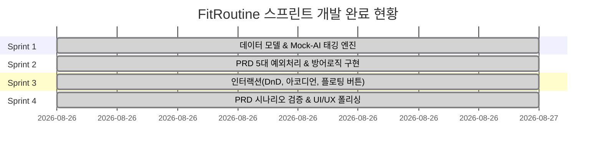

# 🗺️ FitRoutine 개발 로드맵 (Roadmap)

본 로드맵은 PRD 요구사항을 충족하기 위한 4단계 스프린트 계획 및 완료 현황입니다.

---

## 📊 스프린트 완료 현황 (Status)

---

## 🏃 스프린트별 산출물 및 완료 내역

### 🎯 Sprint 1: 데이터 모델 및 Mock-AI 자동 태깅 엔진 (🟢 완료)
- `Exercise` 모델 `isManualTagged` 지원 및 `createEmptyExercise`, `resetExerciseItem` 함수 구현
- 60개 이상 주요 키워드 기반 `WORKOUT_KEYWORD_DICT` 및 `matchMuscleByKeyword` 구현
- 실시간 자동 태깅 및 수동 수정 락 기능 적용
- 📄 상세 문서: [`docs/sprints/sprint-1-core-state-and-tagging.md`](./sprints/sprint-1-core-state-and-tagging.md)

---

### 🛡️ Sprint 2: PRD 5대 예외 처리 및 방어 로직 완벽 구현 (🟢 완료)
- **예외 1:** 태그 매칭 실패 시 '미지정' 처리 및 수동 변경 시 `isManualTagged` 우선순위 보호
- **예외 2:** 운동명 누락 시 세트 포커스 차단 + 1.5초 레드 점멸 애니메이션 & 운동명 강제 포커스
- **예외 3:** 1개 남은 운동 삭제 시 화면 비움 방지 및 빈칸 리셋
- **예외 4:** 무게(소수점 1개) / 횟수(정수) 입력 마스킹, `-` 음수 및 스페이스바 키다운/붙여넣기 원천 차단
- **예외 5:** 필터링 상태에서 운동 추가 시 필터 강제 '전체' 리셋
- 📄 상세 문서: [`docs/sprints/sprint-2-exception-handling.md`](./sprints/sprint-2-exception-handling.md)

---

### ⚡ Sprint 3: 인터랙션 강화 및 레이아웃 최적화 (🟢 완료)
- 드래그 앤 드롭(DnD) 인덱스 스왑 및 시각 피드백
- CSS Grid 기반 아코디언 애니메이션 및 실시간 볼륨(kg) 연산
- 분할 일별 루틴 자유 편집(루틴명/부제/타겟부위) 지원
- 하단 고정 플로팅 액션 버튼 활성 섹션 연동
- 📄 상세 문서: [`docs/sprints/sprint-3-interaction-and-ux.md`](./sprints/sprint-3-interaction-and-ux.md)

---

### ✨ Sprint 4: PRD 성공 시나리오 E2E 검증 및 품질 완성 (🟢 완료)
- PRD Section 1 성공 조건 1분 시나리오 무결점 통과
- 순수 클라이언트 SPA 아키텍처 및 반응형 모바일/데스크톱 UI 최적화
- `npm run build` 및 `tsc --noEmit` 0 에러 무결성 통과
- 📄 상세 문서: [`docs/sprints/sprint-4-testing-and-polish.md`](./sprints/sprint-4-testing-and-polish.md)
