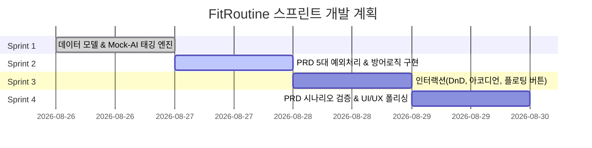

# 🗺️ FitRoutine 개발 로드맵 (Roadmap)

본 로드맵은 PRD 요구사항을 충족하기 위한 4단계 스프린트 계획입니다.

---

## 📊 스프린트 개요 (Overview)

---

## 🏃 스프린트별 목표 및 작업 범위

### 🎯 Sprint 1: 데이터 모델 및 Mock-AI 자동 태깅 엔진
- **목표:** PRD에 명시된 7개 부위 및 운동명 키워드 딕셔너리 기반 Mock-AI 태깅 시스템 구축
- **주요 작업:**
  - `Exercise` 모델에 `isManualTagged` 불리언 플래그 추가
  - 한국어/영어 운동명 키워드 매핑 딕셔너리 (`WORKOUT_KEYWORD_DICT`) 구현
  - 운동명 `onChange` 시 자동 태깅 및 수동 수정 시 플래그 락(lock) 로직 구축
  - '미지정' 태그 처리 및 태그 선택 팝오버 연동
- **산출 문서:** [`docs/sprints/sprint-1-core-state-and-tagging.md`](./sprints/sprint-1-core-state-and-tagging.md)

---

### 🛡️ Sprint 2: PRD 5대 예외 처리 및 방어 로직 완벽 구현
- **목표:** PRD 섹션 5의 5가지 핵심 예외 케이스 완벽 차단 및 UI 피드백 구현
- **주요 작업:**
  - **예외 1:** 태그 매칭 실패 시 '미지정' 표시 및 수동 변경 시 `isManualTagged` 우선순위 보호
  - **예외 2:** 운동명 빈칸 시 세트/무게 입력 시도 차단 + 운동명 필드 1.5초 레드 테두리 깜빡임(`Blink`) 애니메이션 & 포커스 강제 이동
  - **예외 3:** 마지막 1개 운동 항목 삭제 시 삭제 대신 빈칸(운동명 `""`, 태그 `미지정`, 세트 초기화)으로 리셋
  - **예외 4:** 무게(숫자 + 소수점 1개) 및 횟수(정수) 입력 마스킹, `-`(음수)/스페이스바 `preventDefault()` 원천 차단
  - **예외 5:** 필터링 상태에서 운동 추가 시 필터를 즉시 '전체'로 강제 리셋하여 신규 항목 노출 보장
- **산출 문서:** [`docs/sprints/sprint-2-exception-handling.md`](./sprints/sprint-2-exception-handling.md)

---

### ⚡ Sprint 3: 인터랙션 강화 및 레이아웃 안정화
- **목표:** 빠르고 끊김 없는 모바일/데스크톱 인터랙션 환경 구축
- **주요 작업:**
  - 드래그 앤 드롭(Drag & Drop) 순서 변경 정밀화
  - 아코디언 확장/축소 애니메이션 최적화
  - 분할(무분할~5분할) 전환 시 상태 동기화 및 퀵 탭 UX 향상
  - 하단 플로팅 '운동 추가 (+)' 버튼과 현재 활성 분할/섹션 간 연결
- **산출 문서:** [`docs/sprints/sprint-3-interaction-and-ux.md`](./sprints/sprint-3-interaction-and-ux.md)

---

### ✨ Sprint 4: PRD 성공 시나리오 E2E 검증 및 완성도 향상
- **목표:** PRD 1분 시나리오 검증 및 최종 배포 품질 확보
- **주요 작업:**
  - PRD 성공 조건 시나리오 테스트:
    1. 3분할 선택
    2. 운동 3개 추가 및 세트/무게 입력
    3. 태그 1개 수동 수정
    4. '가슴' 부위 필터링 뷰 확인
  - 엣지 케이스 종합 검증 (빠른 연타, 잘못된 입력 등)
  - 다크/라이트 테마 일관성 및 타이포그래피 정돈
- **산출 문서:** [`docs/sprints/sprint-4-testing-and-polish.md`](./sprints/sprint-4-testing-and-polish.md)
