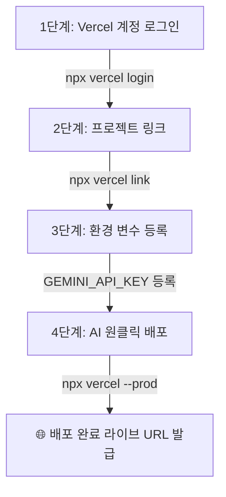

# 🚀 Vercel 배포 및 AI 원클릭 배포 연동 가이드

본 문서는 FitRoutine 프로젝트를 **Vercel CLI**와 연결하여, 향후 AI 어시스턴트에게 "배포해줘"라고 명령하면 자동으로 프로덕션 배포가 수행되도록 셋팅하는 절차 가이드입니다.

---

## 📋 사전 준비 사항
- Vercel 계정 (가입 완료 상태)
- Vercel CLI 로컬 설치 완료 (`npx vercel` v59.7.0)

---

## 🛠️ 연동 및 배포 작업 순서 (Step-by-Step)



### [1단계] Vercel CLI 계정 최초 1회 로그인
터미널에서 아래 명령어를 실행하여 브라우저 인증을 완료합니다:
```bash
npx vercel login
```
- 브라우저 창이 열리면 사용하시는 Vercel 로그인 방식(GitHub, 이메일, 구글 등)을 선택해 승인합니다.

---

### [2단계] 현재 프로젝트와 Vercel 프로젝트 연결 (`link`)
터미널에서 프로젝트를 연결합니다:
```bash
npx vercel link
```
- **Set up and deploy?** ➡️ `Y`
- **Which scope do you want to deploy to?** ➡️ 사용자 계정/팀 선택
- **Link to existing project?** ➡️ `N` (신규 프로젝트 생성 시)
- **What’s your project’s name?** ➡️ `fit-routine` (엔터)
- **In which directory is your code located?** ➡️ `./` (엔터)

연결이 완료되면 프로젝트 루트에 `.vercel/` 설정 폴더가 자동 생성됩니다.

---

### [3단계] 프로덕션 환경 변수(Gemini API 키) 등록
Gemini AI 기능이 배포 환경에서도 동작하도록 Vercel 환경 변수를 등록합니다:
```bash
npx vercel env add GEMINI_API_KEY production
```
- 프롬프트가 나오면 `.env`에 있는 Gemini API 키(`your_gemini_api_key`)를 붙여넣기합니다.
- *(또는 Vercel 웹 대시보드 ➡️ Project Settings ➡️ Environment Variables 에서 직접 등록 가능)*

---

### [4단계] AI 원클릭 프로덕션 배포 실행
위 1~3단계가 완료된 후에는 언제든 아래와 같이 AI에게 요청하시면 됩니다:

> 💬 **"프로덕션으로 배포 진행해줘"**

AI가 아래 명령어를 실행하여 즉시 빌드 및 프로덕션 배포를 완료하고 라이브 URL을 제공합니다:
```bash
npx vercel --prod --yes
```

---

## ⚡ 대안: Vercel GitHub 연동 (완전 자동 배포)
- Vercel 대시보드([vercel.com/new](https://vercel.com/new))에서 GitHub 저장소 `juyour/fit-routine`을 Import 해두시면, AI가 Git에 커밋/푸시할 때마다 Vercel이 **자동으로 빌드 및 무중단 배포**를 수행합니다.
